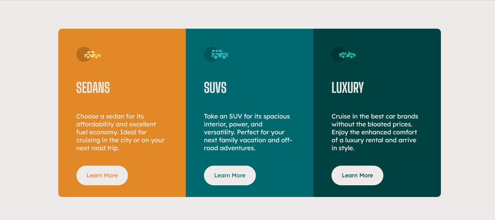

# Frontend Mentor - 3-column preview card component solution

This is a solution to the [3-column preview card component challenge on Frontend Mentor](https://www.frontendmentor.io/challenges/3column-preview-card-component-pH92eAR2-). Frontend Mentor challenges help you improve your coding skills by building realistic projects.

## Table of contents

- [Overview](#overview)
  - [The challenge](#the-challenge)
  - [Screenshot](#screenshot)
  - [Links](#links)
- [My process](#my-process)
  - [Built with](#built-with)
  - [What I learned](#what-i-learned)
  - [Continued development](#continued-development)
- [Author](#author)


## Overview

### The challenge

- Build out the project to the designs provided

### Screenshot




### Links

- Solution URL: [Add solution URL here](https://your-solution-url.com)
- Live Site URL: [Add live site URL here](https://your-live-site-url.com)

## My process

### Built with

- float
- Mobile-first workflow


### What I learned

-3 column layout
-mobile first


Some CSS code I'm proud of

```css
#wrapper {
  max-width: 75%;
  margin: 5em auto;
  border-radius: 10px;
  overflow: hidden;
}

@media only screen and (min-width: 375px) {

  .sedans,
  .suvs,
  .luxury {
    float: none;
    width: 100%;
  }

  .luxury {
    border-top-right-radius: 0px;
  }
}

@media only screen and (min-width: 1100px) {

  .sedans,
  .suvs,
  .luxury {
    float: left;
    width: 33.333%;
  }
}

```


### Continued development

I want to continue focusing on: CSS Flex, Grid, mobile first approach and React.js in future projects. These are concepts i am still not completely comfortable with or techniques i found useful that i want to refine and perfect.


## Author

- Linkedin - [Ramil Novruzov](https://www.linkedin.com/in/ramilnovruzov/)
- Frontend Mentor - [@ramikoff](https://www.frontendmentor.io/profile/ramikoff)
